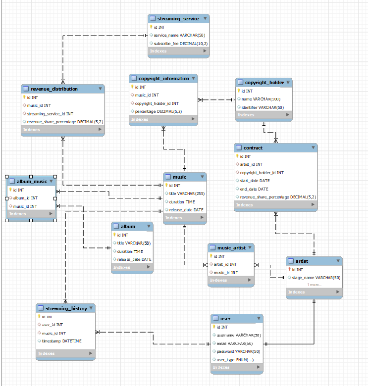

**Documentação do Projeto IndieSoundHub**

---

## Índice

1. [Introdução](#introdução)
2. [Modelo de Dados](#modelo-de-dados)
    1. [Tabelas](#tabelas)
    2. [Relacionamentos](#relacionamentos)
3. [Instruções SQL](#instruções-sql)
4. [Consultas](#consultas)
    1. [Número de Streams por Música](#número-de-streams-por-música)
    2. [Receita Total por Serviço de Streaming](#receita-total-por-serviço-de-streaming)
    3. [Histórico de Streaming por Usuário](#histórico-de-streaming-por-usuário)
    4. [Duração Média de Reprodução por Usuário](#duração-média-de-reprodução-por-usuário)
    5. [Número de Contratos Ativos por Artista](#número-de-contratos-ativos-por-artista)

---

## 1. Introdução

O projeto IndieSoundHub é uma plataforma dedicada à distribuição de música e gestão de direitos autorais para artistas independentes. O banco de dados foi desenvolvido para armazenar informações sobre artistas, contratos de direitos autorais, músicas, álbuns, serviços de streaming e histórico de reprodução.

---

## 2. Modelo de Dados

### 2.1 Tabelas

O banco de dados `IndieSoundHub` possui as seguintes tabelas:

- `album`
- `user`
- `artist`
- `copyright_holder`
- `contract`
- `music`
- `copyright_information`
- `streaming_service`
- `revenue_distribution`
- `streaming_history`
- `album_music`
- `music_artist`

### 2.2 Relacionamentos

As relações entre as tabelas são estabelecidas por meio de chaves estrangeiras (`FOREIGN KEY`). Destacam-se os seguintes relacionamentos:

- `artist` se relaciona com `user` por meio da chave estrangeira (`id`).
- `contract` possui chaves estrangeiras para `artist` e `copyright_holder`.
- `copyright_information` relaciona `music` e `copyright_holder`.
- `revenue_distribution` possui chaves estrangeiras para `music` e `streaming_service`.
- `streaming_history` está vinculada a `user` e `music`.
- `album_music` e `music_artist` são tabelas de associação para relacionamentos muitos-para-muitos.

---

## 3. Instruções SQL

O script SQL inicia criando o banco de dados `IndieSoundHub` e definindo suas tabelas. Em seguida, são inseridos dados nas tabelas para simular informações de usuários, artistas, contratos, músicas, álbuns, serviços de streaming e histórico de reprodução.

---

## 4. Consultas

### 4.1 Número de Streams por Música

A consulta retorna o número de streams para cada música na plataforma.

```sql
SELECT music.title, COUNT(streaming_history.id) AS number_of_streams
FROM music
LEFT JOIN streaming_history ON music.id = streaming_history.music_id
GROUP BY music.title;
```

### 4.2 Receita Total por Serviço de Streaming

A consulta calcula a receita total gerada por cada serviço de streaming.

```sql
SELECT streaming_service.service_name, SUM(revenue_distribution.revenue_share_percentage * streaming_service.subscribe_fee) AS total_revenue
FROM streaming_service
LEFT JOIN revenue_distribution ON streaming_service.id = revenue_distribution.streaming_service_id
GROUP BY streaming_service.service_name;
```

### 4.3 Histórico de Streaming por Usuário

A consulta exibe o histórico de streaming, incluindo o usuário, a música e o timestamp.

```sql
SELECT user.username, music.title AS music_title, streaming_history.timestamp
FROM user
JOIN streaming_history ON user.id = streaming_history.user_id
JOIN music ON streaming_history.music_id = music.id;
```

### 4.4 Duração Média de Reprodução por Usuário

Calcula a duração média de reprodução por usuário.

```sql
SELECT user.username, AVG(TIME_TO_SEC(music.duration)) AS average_play_duration
FROM user
JOIN streaming_history ON user.id = streaming_history.user_id
JOIN music ON streaming_history.music_id = music.id
GROUP BY user.username;
```

### 4.5 Número de Contratos Ativos por Artista

A consulta lista o número de contratos ativos para cada artista.

```sql
SELECT artist.stage_name, COUNT(contract.id) AS active_contracts
FROM artist


LEFT JOIN contract ON artist.id = contract.artist_id
WHERE contract.end_date > CURDATE()
GROUP BY artist.stage_name
ORDER BY active_contracts DESC;
```

---

**Conclusão**

O IndieSoundHub oferece uma estrutura robusta para gerenciar e distribuir músicas de artistas independentes, proporcionando proteção aos direitos autorais por meio de contratos e informações específicas. O sistema é flexível, permitindo adaptações contínuas para acompanhar as mudanças no cenário da música independente.

## Apresentação do Projeto
[Apresentação Visual](https://www.canva.com/design/DAF3SH4tL4Q/dPra9wmcKISZ4Nf41z5P_w/edit?utm_content=DAF3SH4tL4Q&utm_campaign=designshare&utm_medium=link2&utm_source=sharebutton)

## Diagrama do Projeto


